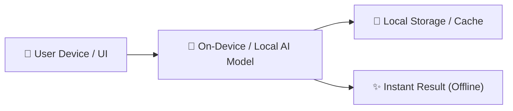

# 🚀 [Project Name]

> **AppBuildersPH Hackathon 2026 Submission**  
> *Theme:* **Local AI** — *"Build an AI product that remains genuinely useful when the cloud disappears."*

---

## 📖 Overview & Value Proposition
[Short 2-3 sentence elevator pitch describing the project, the specific user problem it solves, and why local on-device AI is the killer differentiator.]

---

## ⚡ Why Local AI? (The Core Advantage)
- 🔒 **100% Privacy:** Sensitive data, user inputs, and local files never leave the device.
- 📴 **Zero Internet Required:** Fully functional offline or in air-gapped / disaster conditions.
- ⚡ **Ultra-Low Latency:** Immediate on-device response without cloud round-trip delays.
- 💸 **Zero Token / Cloud Costs:** Free, unlimited local AI inference for users.

---

## 🛠️ Architecture & Tech Stack



- **Frontend / Client:** [e.g. Next.js / React / TypeScript / Tailwind CSS]
- **Local AI Engine / Framework:** [e.g. Ollama / Transformers.js / WebLLM / MediaPipe / ONNX Runtime]
- **Models Used:** [e.g. Llama 3.2 1B / Gemma 2B / Whisper / SmolLM]
- **AI Tooling Disclosure:** [e.g. Built using Devin, Copilot, ChatGPT for development assistance]

---

## 🚀 Quickstart & Local Reproduction Guide

### Prerequisites
- Node.js (v18+ / v20+) or Python 3.10+
- [Local model runner if needed, e.g. `ollama` or WebGPU-enabled browser]

### 1. Clone the repository
```bash
git clone https://github.com/[team-username]/[repo-name].git
cd [repo-name]
```

### 2. Install dependencies
```bash
npm install
# or pnpm install / yarn
```

### 3. Environment Setup
```bash
cp .env.example .env
```

### 4. Run the application
```bash
npm run dev
```
Open [http://localhost:3000](http://localhost:3000) in your browser.

---

## 👥 Team Members & Contributions

| Member Name | Role | Primary Contributions |
| :--- | :--- | :--- |
| **[Member 1]** | UI/UX & Submission Lead | User Journey, Wireframes, Video Demo & Pitch |
| **[Member 2]** | Frontend Developer | UI Components, State Management, Client Integration |
| **[Member 3]** | Backend / AI Developer | Local Model Pipeline, Prompting & Data Flow |
| **[Member 4]** | Fullstack Developer | Core Feature Engineering & System Integration |

---

## 📄 License
This project is licensed under the MIT License - see the [LICENSE](LICENSE) file for details.