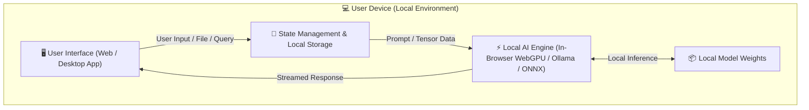

# Technical Architecture & Local AI Pipeline

## 1. High-Level Architecture Overview
This document outlines how the application achieves 100% on-device/local AI execution without relying on cloud inference.

---

## 2. Local AI Execution Details
- **Inference Mode:** [e.g. In-Browser WebGPU / Localhost REST API / WebAssembly]
- **Quantization:** [e.g. Q4_K_M / INT8 / FP16]
- **Latency / Performance Target:** Under [X] ms per generation.
- **Data Privacy Guarantee:** Zero outgoing network requests during inference.

---

## 3. Fallbacks & Offline Strategy
- **Offline Detection:** `navigator.onLine` checks & graceful UI banners.
- **Model Caching:** Browser Cache API / IndexedDB / Local filesystem persistence.
