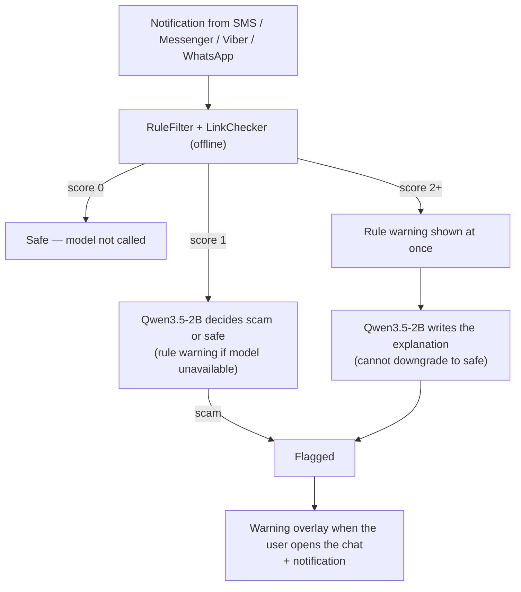

# Technical Architecture & Local AI Pipeline

## 1. High-Level Architecture Overview
Bantai is a native Android app (Kotlin, minSdk 26, targetSdk 35). Every scam check runs on the phone: rule scoring, link checks, and LLM inference. The app does not request the `INTERNET` permission.

1. **Notification screening** (`BantaiNotificationListener`, `NotificationExtractor`): a `NotificationListenerService` reads notifications from Google Messages, Samsung Messages, AOSP Messaging, Messenger, Viber, and WhatsApp only.
2. **Layer 1, rules (instant)** (`RuleFilter`, `LinkChecker`): `RuleFilter` checks 7 signals: money request, new number / impersonation, suspicious link, dangerous link, prize / raffle, account / OTP / parcel, and urgency. `LinkChecker` catches fake brand domains (GCash, Maya, BDO, BPI, Shopee, LBC, SSS, Meralco, and others), URL shorteners, risky domain endings, IP-address links, and lookalike sites. It makes no web requests.
3. **Layer 2, on-device LLM** (`ScamPipeline`):
   - Score 0: the model is not called.
   - Score 1: the model's verdict decides.
   - Score 2+: the rule warning shows immediately. The model then writes the explanation but cannot mark the message safe.
   - The model's own reason is shown in the warning. The suggested action comes from app templates.
   - If the model isn't loaded, times out (25 s), or gives no verdict, the rule result is used.
   - Saved contact asking for money (with no link, OTP, or prize in the message): marked **Suspicious** instead of Scam, since their account may have been hacked. The warning has a "Call [name]" button that opens the dialer. This uses the optional Contacts permission; contacts are only read on the phone.
4. **Warning in context** (`BantaiAccessibilityService`, `ScamAlertOverlay`, `ScamNotifier`): an `AccessibilityService`, limited to the same messaging apps, shows the warning overlay next to the flagged message when the user opens the chat. If accessibility is off, the overlay appears right away. A "possible scam" notification is also posted.

### Protection switch (on/off)
**When Protection is OFF, Bantai stops screening messages.** The switch is on the Setup screen and in the Settings tab, and the Home tab shows whether protection is active or paused.
- **OFF:** incoming notifications are ignored. No rule check, no AI check, no new warnings or "possible scam" notifications, and nothing new is added to Alerts.
- **Still works while OFF:** the Check tab (manual checks), the call warning (if Bantai is set as the Caller ID & spam app), and warnings for messages that were already flagged before protection was turned off.

### Other features
- **Check tab:** paste any text or link to check it. The model is always consulted here and can override rule flags, except for fake-brand links, which are always flagged.
- **Alerts tab:** history of flagged messages stored on the device, with an audit showing whether the AI model or the rules made the decision.
- **Call warning (Android 10+)** (`BantaiCallScreening`): if Bantai is set as the Caller ID & spam app, it warns on incoming calls from numbers not in contacts. The warning is stronger if that number already sent a flagged text. This uses rules only: no AI, no call audio, and calls are never blocked.
- **Language:** English by default. Tagalog when the app language is set to Tagalog (Settings → Apps → Bantai → Language). The AI's explanation follows the same language.

---

## 2. Local AI Execution Details
- **Runtime:** Google LiteRT-LM `0.18.0` (`com.google.ai.edge.litertlm:litertlm-android`), CPU backend (`LiteRtEngine`).
- **Model:** Qwen3.5-2B, int8 `.litertlm` (`Qwen3.5-2B_int8.litertlm`, ~2.1 GB, from `litert-community/Qwen3.5-2B`, Apache-2.0). Gemma 3 1B IT int4 is supported in code as an optional fallback.
- **Prompt** (`PromptBuilder`): a few-shot prompt with one scam example and one safe example. The message is cut to 160 characters, and rule signals are passed as hints. The model is asked for two lines, `VERDICT` and `REASON`, in the app's language.
- **Generation:** max 48 output tokens, temperature 0.2, top-k 10, top-p 0.9. A new conversation is created for each check, so no history carries over. Only one inference runs at a time.
- **Parsing** (`ScamParser`): reads `VERDICT`/`HATOL` and `REASON`/`DAHILAN`. A reply without a verdict line is discarded and the rule result is used.
- **Timeout:** 25 s per check (`ScamPipeline.DEFAULT_TIMEOUT_MS`).
- **Data privacy:** message text is only passed to the on-device model. The app has no `INTERNET` permission, so it cannot send data off the phone.

### Model selection (`Bantai.kt`)
Bantai loads one model per phone, based on total RAM as reported by Android and which model file is present:

| Priority | Model file | Minimum reported RAM |
| :--- | :--- | :--- |
| 1 | `Qwen3.5-2B_int8.litertlm` (~2.1 GB) | 6,000 MB |
| 2 | `gemma3-1b-it-int4.litertlm` (~580 MB), optional fallback | 5,500 MB |
| — | none → rules + link checks only | — |

Our team built and tested with **Qwen3.5-2B**. The Gemma 3 1B fallback is supported in code but is optional.

---

## 3. Fallbacks & Offline Strategy
- **No internet needed at runtime:** everything runs on the phone. Internet is only needed once before use, to download the model file.
- **Model loading:** a debug build reads the model from `/data/local/tmp/llm/` (pushed with `adb`). A release build bundles the model from `models/` into the APK and copies it to app storage once on first run, since LiteRT-LM needs a real file path.
- **Low-RAM phones:** if no model fits the phone's RAM, Bantai runs rules + link checks only, so protection stays on.
- **Model failures:** if the model fails to load, isn't ready, times out, or gives no usable verdict, the rule result is used.
