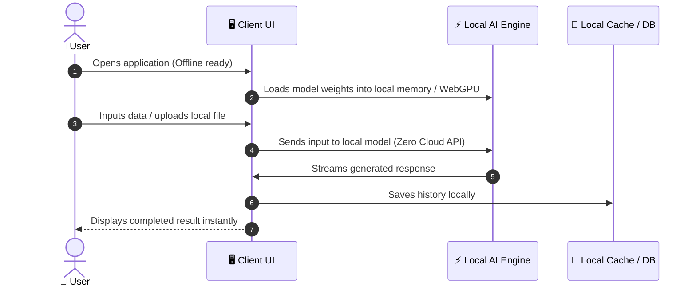

# User Journey & Workflow Map

## 1. Target User Persona
- **Who:** [e.g. Developer / Student / Field Worker / Privacy-conscious User]
- **Primary Pain Point:** [e.g. Cannot upload confidential files to public cloud / Works in remote areas with zero internet]

---

## 2. Core User Journey Flow

---

## 3. Key UX Touchpoints & Edge States
- **Model Load State:** Clear loading bar indicating model initialization and download progress.
- **Hardware/VRAM Indicator:** Subtle visual feedback on local engine status.
- **Offline Confirmation:** Visual badge indicating 100% private, on-device computation.
